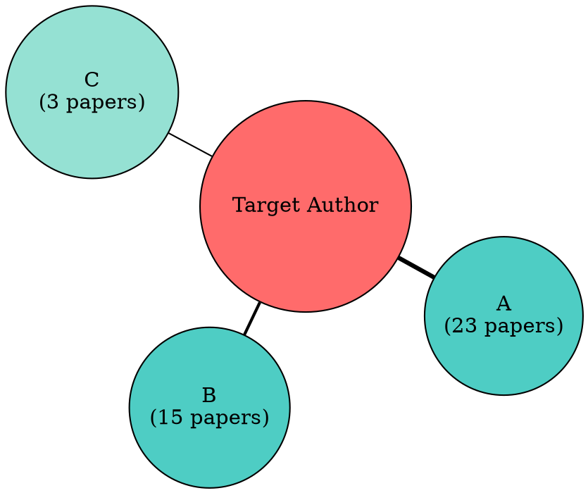

# Author Network — Researcher Profile and Collaboration Analysis

Analyze researcher profiles, collaboration patterns, and research trajectories. Understand who works with whom, how research directions evolve over time, and which researchers to follow or collaborate with.

## Core Capabilities

### Author Profile
Build a comprehensive researcher profile using S2 and OpenAlex APIs:

```yaml
author_profile:
  name: "Jane Smith"
  author_id: "S2:1741101 / OA:A502388"
  affiliations: ["MIT CSAIL", "Stanford (formerly)"]
  metrics:
    total_papers: 156
    total_citations: 18432
    h_index: 42
    i10_index: 98
  active_since: 2008
  primary_fields: ["Machine Learning", "Natural Language Processing"]
  orcid: "0000-0001-2345-6789"
```

### Collaboration Network
Map co-authorship relationships to identify research communities.

### Research Evolution
Track how an author's research focus shifts over time.

### Academic Genealogy
Trace mentor-student relationships through co-authorship patterns.

## Workflow

### Step 1: Resolve Author Identity
**Input:** author name (e.g., "Yann LeCun") or author ID
**Output:** resolved author object {authorId, name, affiliations, paperCount, citationCount, hIndex}
```bash
# Search by name
GET https://api.semanticscholar.org/graph/v1/author/search?query=Jane+Smith&limit=5

# Get author details
GET https://api.semanticscholar.org/graph/v1/author/{id}?fields=name,affiliations,paperCount,citationCount,hIndex

# Get author's papers
GET https://api.semanticscholar.org/graph/v1/author/{id}/papers?fields=title,year,citationCount,authors&limit=500&sort=year:desc
```

### Step 2: Build Collaboration Graph
**Input:** author ID + paper list from Step 1
**Output:** {nodes[], edges[]} with collaborator classification and weights

From the author's paper list, extract co-author pairs:

```python
# For each paper, create edges between all author pairs
# Edge weight = number of co-authored papers
# Node size = total citations or h-index
```

**Graph data structure:**
```json
{
  "nodes": [
    {"id": "author_1", "name": "Jane Smith", "papers_together": 15, "coauthor_type": "frequent"},
    {"id": "author_2", "name": "John Doe", "papers_together": 3, "coauthor_type": "occasional"}
  ],
  "edges": [
    {"source": "target_author", "target": "author_1", "weight": 15, "type": "coauthor"},
    {"source": "target_author", "target": "author_2", "weight": 3, "type": "coauthor"}
  ]
}
```

**Collaborator classification:**
| Type | Co-authored Papers | Interpretation |
|---|---|---|
| **Core** | 10+ | Likely same lab or long-term partnership |
| **Frequent** | 5-9 | Regular collaboration |
| **Occasional** | 2-4 | Project-based collaboration |
| **One-time** | 1 | Single joint paper |

### Step 3: Analyze Research Evolution
**Input:** paper list from Step 1
**Output:** research_timeline[] with {period, focus, key_papers, venues} per 3-year window

Plot the author's research direction over time using **3-year windows** (aligned with `scripts/author_profile.py`):

```yaml
research_timeline:
  - period: "2007-2009"
    focus: ["Statistical Machine Translation"]
    key_papers: ["Paper A", "Paper B"]
    venues: ["ACL", "EMNLP"]

  - period: "2010-2012"
    focus: ["Neural Language Models"]
    key_papers: ["Paper C", "Paper D"]
    venues: ["NeurIPS", "ICML"]

  - period: "2013-2015"
    focus: ["Word Embeddings", "Representation Learning"]
    key_papers: ["Paper E", "Paper F"]
    venues: ["NeurIPS", "ICML"]

  - period: "2016-2018"
    focus: ["Attention Mechanisms", "Transformer Models"]
    key_papers: ["Paper G"]
    venues: ["NeurIPS", "ICLR"]

  - period: "2019-2021"
    focus: ["Pre-trained Language Models"]
    key_papers: ["Paper H", "Paper I"]
    venues: ["ACL", "NeurIPS"]

  - period: "2022-2024"
    focus: ["Large Language Models", "Prompt Engineering"]
    key_papers: ["Paper J", "Paper K"]
    venues: ["NeurIPS", "ICLR", "ACL"]
```

**Detection method** (3-year grouping):
1. Group papers into 3-year windows: `period = (year // 3) * 3`, yielding ranges like 2007-2009, 2010-2012, etc.
2. Extract key terms from titles (frequency of words > 4 characters)
3. Identify field labels from S2 `fieldsOfStudy`
4. Track venue changes across periods
5. Identify pivot points (period where dominant topic changes)

### Step 4: Detect Academic Genealogy
**Input:** paper list + collaboration graph from Steps 1-2
**Output:** {mentors[], mentees[], peers[]} with evidence and confidence level

Infer mentor-student relationships:

**Heuristics:**
- Early-career papers with a senior author → likely advisor
- Last author on early papers of a junior author → likely advisor
- University affiliation overlap during early career → same lab
- Gradual shift from middle-author to first/last author → career progression

```yaml
academic_tree:
  mentors:
    - name: "Senior Prof"
      relationship: "likely PhD advisor"
      evidence: "7 joint papers during 2008-2012, same affiliation"

  mentees:
    - name: "Junior Researcher A"
      relationship: "likely PhD student"
      evidence: "5 joint papers 2019-2023, target is last author"

  peers:
    - name: "Collaborator B"
      relationship: "peer collaborator"
      evidence: "Occasional co-authorship, different institution"
```

### Step 5: Generate Author Report
**Input:** all data from Steps 1-4
**Output:** formatted Markdown author report

```markdown
## Author Profile: Jane Smith

### Overview
- **Affiliation:** MIT CSAIL
- **Papers:** 156 | **Citations:** 18,432 | **h-index:** 42
- **Active since:** 2008
- **Primary fields:** ML, NLP

### Research Evolution
```
Citations
  ^
  |                          ████
  |                     ████ ████
  |                ████ ████ ████
  |           ████ ████ ████ ████
  |      ████ ████ ████ ████ ████
  +──────|──────|──────|──────|──► Year
       2010   2014   2018   2022

  2008-12: Statistical MT → 2013-17: Word Embeddings → 2018+: LLMs
```

### Top Collaborators (10+ papers)
| Collaborator | Joint Papers | Affiliation | Type |
|---|---|---|---|
| Robert Chen | 23 | MIT CSAIL | Core (same lab) |
| Maria Garcia | 15 | Google DeepMind | Core |
| ...

### Academic Network
- **Likely advisor:** Prof. X (7 joint papers 2008-2012, Stanford)
- **Likely students:** Y (first author on 5 papers, 2019-2023)

### Notable Papers (Top 5 by citations)
1. [Paper] (2018) — 3,200 citations
2. ...
```

## Visualization Options

### Co-authorship Network (DOT)


### Research Timeline (ASCII)
```
Year  Topic
2008  ████ Statistical MT
2009  ██████ Statistical MT
2010  ████ Statistical MT + Neural Nets
2011  ████████ Neural NLP
...
```

## Error Handling and User Checkpoints

### Checkpoints
- **After Step 1 (resolve author identity)**: if search returns multiple matches, present ALL candidates with affiliations, paper counts, and h-indices. Do not auto-select. Ask user to confirm the correct author.
- **After Step 3 (research evolution)**: present the detected timeline and pivot points. Ask user whether the timeline accurately reflects the author's trajectory.
- **Before genealogy claims (Step 4)**: warn user that genealogy is inferred from co-authorship patterns, not verified. Present evidence and ask user to confirm or correct mentor/mentee relationships.

### Error Handling
- **Author disambiguation failure**: if multiple authors share the same name and no unique identifier is available, present the ambiguity with available distinguishing data (institution, field, time period). Ask user to select.
- **Missing affiliation data**: if S2/OpenAlex returns no affiliations, note the gap. Do not assume current institution from historical data.
- **Very large publication lists** (>500 papers): warn that analysis may be incomplete. Suggest focusing on recent N papers or top-cited N papers.
- **Name variations**: if an author publishes under multiple names (e.g., "J. Smith", "John Smith", "J.D. Smith"), attempt to merge by authorId. Flag unresolvable variations to user.

## Integration with Other Skills

- **semantic-scholar** — Author search, paper lists, metrics
- **scientific-skills:openalex-database** — Alternative author data with institution info
- **citation-graph** — Visualize citation networks for specific authors
- **research-trends** — Compare author trajectory with field trends

## Additional Resources

### Reference Files
- **`references/api-patterns.md`** — S2 and OpenAlex API patterns for author queries

### Scripts
- **`scripts/author_profile.py`** — Build author profile and collaboration graph from APIs
